# 一体化编辑平台设计文档

## 目录

1. [地图基础知识](#地图基础知识)
	1. [地图术语](#地图术语)
	1. [坐标系统](#坐标系统)
	1. [基础计算](#基础计算)
1. [常用库介绍](#常用库介绍)
1. [总体架构](#总体架构)
1. [模块类图]()

## 地图基础知识

首先介绍一下地图软件常用的术语

### 地图术语

在地图软件中有一些特定的,约定俗成的术语:

* **[要素](#要素)**
* **[几何](#几何)**
* **[数据源](#数据源)**
* **[符号](#符号)**
* **[渲染](#渲染)**
* **[反馈](#反馈)**
* **[高亮](#高亮)**
* **[空间索引](#空间索引)**
* **[瓦片](#瓦片)**
* **[图幅](#图幅)**
* **[网格](#网格)**
* **[场景](#场景)**
* **[捕捉](#捕捉)**

#### 要素

现实世界中的任何物体都被抽象为地图要素Feature.地图要素主要有两个属性:

* `geometry:` 地图要素的几何属性,用于表达地图要素的形状,可以大致分为点线面几类,详见[几何](#几何)小节
* `properties:` 地图要素的除几何以外的其他属性,通常有一个id字段和type字段,组合起来可唯一标识一个要素

#### 几何

地图要素的几何属性可以根据[OpenGIS Simple Features Implementation Specification](http://www.opengeospatial.org/standards/sfa)分为以下几类:
* `Point:` 代表一个点

		
	
* `MultiPoint:` 若干点组成的集合

	
	
* `LineString:` 由若干点按顺序组成的线串,其中LinearRing是LineString的首尾点相等时的特例.其中组成LineSting的每个点称为**形状点**,两个形状点构成的直线段称为**形状边**

	
	
	
* `MultiLineString:` 若干LineString组成的集合

	
	
* `Polygon:` 多边形由一个外壳和若干洞组成,也可以没有洞.其中外壳是顺时针方向,洞是逆时针方向

	
	
* `MultiPolygon:` 若干Polygon组成的集合

	
	
* `GeometryCollection:` 若干任意类型Geometry组成的集合

	
	
#### 数据源

数据源代表了若干地图要素的集合,其中通常会按照[瓦片](#瓦片)和要素类型来组织数据,可能还包含有各种类型的索引.

#### 符号

符号是对绘制细节的抽象,负责将地图要素绘制成可见的各种符号.

#### 渲染

渲染指的是使用符号将地图要素绘制到设备上的过程.

#### 反馈

用户在地图上做的各种操作需要视觉反馈来告诉操作的结果.反馈由若干符号组成.

#### 高亮

当用户选中某个地图要素以后,需要将被选中的要素以突出的样式绘制出来,这称为要素的高亮.要素高亮由若干反馈组成.

#### 空间索引

为了提高几何查询的效率,通常会以要素几何的**最小外包矩形**构造空间索引,最长用的空间索引有**网格索引**,**R树**,**四叉树**等.

#### 瓦片

将横轴墨卡托投影得到的世界地图按照固定大小(通常是256或512)切成正方形小片,每一片都称为一个瓦片,通常0级地图用一个瓦片表示,1级地图使用4个瓦片表示,以此类推.其中每个瓦片都有固定的行列号x,y

#### 图幅

待补充

#### 网格

待补充

#### 场景

场景由若干相关的图层构成,通常每种要素对应一个场景

#### 捕捉

捕捉通常用于在地图上拾取要素,有各种各样的捕捉,比如捕捉要素的,捕捉形状点的,捕捉最近点的等

### 坐标系统

坐标系统可以分为两大类:
* 地理坐标系:为球面坐标.参考平面地是椭球面,坐标单位通常是经纬度
* 投影坐标系:为平面坐标.参考平面地是水平面,坐标单位通常是米、千米等,我国比较常用的投影坐标系有北京54和西安80坐标系
地理坐标转换到投影坐标的过程可理解为投影(投影：将不规则的地球曲面转换为平面)

通常需要计算以米为单位距离的时候需要先将经纬度转换成投影坐标.

关于坐标系统的更详细内容请阅读[链接](http://blog.csdn.net/angelazy/article/details/44085099)

### 基础计算

* `向量:` 很多牵涉到方向的运算过程使用向量会大大简化计算过程
* `矩阵:` 对于坐标的平移,旋转,缩放使用矩阵处理会更简单

## 常用库介绍

在Gis行业有些很成熟的开源库可以使用:

* `java topology suite:` 简称jts,提供一系列的几何运算方法,比如求交,并,差等,还有一系列的分析方法,比如缓冲区,凸包,重心,最近点等.拥有各种语言的移植版本,例如C++的geos,C#的nts,javascript的jsts等.[链接](https://locationtech.github.io/jts/javadoc/index.html)
* `proj4:` 提供各种坐标系之间的转换方法,也拥有众多语言的移植版本.[链接](https://github.com/proj4js/proj4js)
* `lodash:` lodash是从Underscore分化而来,提供了众多的基础的实用方法.已经成为最流行的基础库,众多开源项目都在使用,比如JavaScript转译器Babel、博客平台Ghost，和项目脚手架工具Yeoman.[链接](https://github.com/lodash/lodash/)

## 总体架构

### 设计目标

* 支持全要素的几何编辑和属性编辑
* 几何编辑过程中支持撤销和重做
* 几何编辑过程中每个步骤都可见

下图为一体化编辑平台的总体架构图:

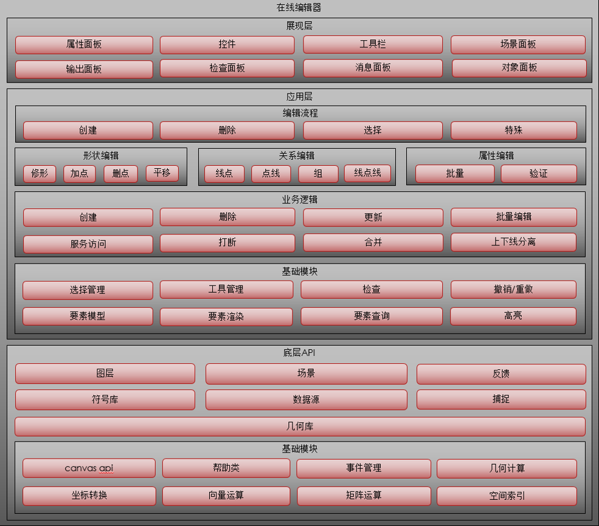

程序总体分为三个层次:

* `底层API:` 主要包含了坐标转换,基础运算,几何运算,空间索引,符号,场景,数据源,反馈,捕捉等模块
* `应用层:` 主要包含了4个层次:

	* `基础模块:` 包含了要素模型,要素渲染,要素选择,高亮,检查,选择管理,工具管理,撤销/重做等
	* `业务逻辑:` 包含了各要素的创建,修改,查询,删除以及上下线分离等
	* `编辑工具:` 主要包含了形状编辑,关系编辑,复杂编辑等
	* `编辑流程:` 地图的所有编辑功能都可以抽象成流程,主要可以划分为选择流程,创建流程,修改流程,复杂流程
	
* `展现层:` 展现层主要是UI相关的逻辑

### 包依赖关系

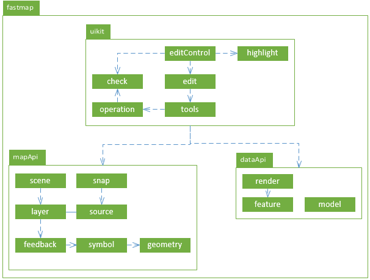

顶级包是fastmap,下面一共包括三个主要的包:

* `mapApi`
	* `geometry:`
	
		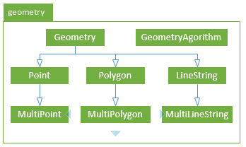
		
		geometry包定义几何类以和提供基本几何算法.
	
		程序内部都应该使用这里定义的几何类型,从服务端接收到几何数据后应该第一时间转换成这里定义的几何类型,保存到服务时再转换成服务需要的几何数据格式.
	
		geometryAgorithm类提供基本的,常用的几何分析方法,其内部调用jsts实现.
		
	* `symbol:`
	
		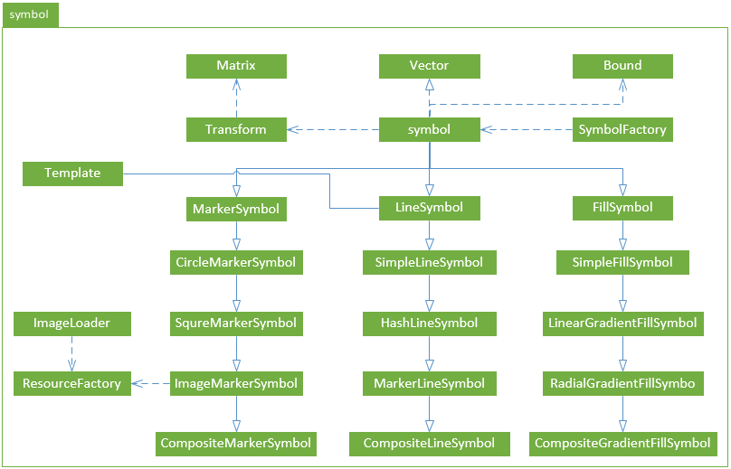
		
		地图上所有可见的要素都抽象为地图符号,总的分为点线面三种符号,三种符号下面各自派生出若干种类型类的符号.每个符号由两部分组成,符号属性和几何.
		
		Vector用于处理向量相关的运算,Matrix处理矩阵相关运算,Transform管理变换矩阵状态
		
		GeometryFactory用于处理geojson和geometry之间的相互转换
		
		ImageLoader用于加载符号用到的图片,ResourceFactory用于管理符号用到的图片
		
		Template处理按照模式切分线段
		
	* `feedback:`
		
		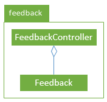
		
		地图上用来提示用户的符号称为反馈,实际上反馈是由若干个符号组成的.所有的反馈的都绘制在一个单独的反馈图层.
		
		Feedback代表一个反馈,由多个符号组成
		
		FeedbackController管理所有的反馈,提供添加,删除,刷新等接口.
		
	* `layer:`
		
		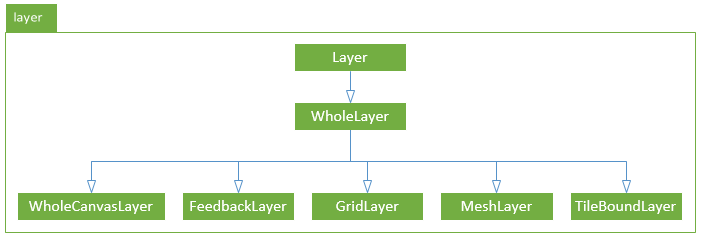
		
		整个地图实际上由多个图层构成,Layer是基类,下面派生出若干个不同类型的图层
		
		FeedbackLayer专门用于绘制反馈
		
		GridLayer专门用于绘制网格
		
		MeshLayer专门用于绘制图幅
		
		TileBoundsLayer专门用于绘制瓦片边界
		
		WholeCanvasLayer专门用于绘制所有的矢量图层
		
	* `source:`
		
		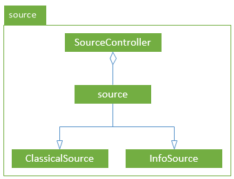
		
		所有从服务器获取的地图数据都会被存储在数据源中,当地图的可视范围发生变化时,数据源中的数据会被更新.
		
		Source代表一个数据源,提供按瓦片,按类型,按id查询等接口
		
		ClassicalSource,InfoSource都从Source派生而来,区别在于CreateParameter方法实现不一样
		
		SourceController用于管理所有的数据源,解析数据源配置文件,请求服务数据等
		
	* `scene:`
		
		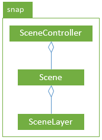
		
		场景由多个图层组成
		
		SceneLayer表示场景中的一个图层
		
		Scene表示一个场景
		
		SceneController用于管理所有的场景
		
	* `snap:`
		
		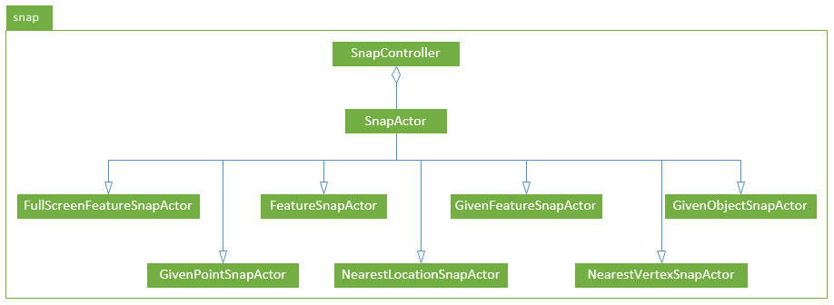
		
		捕捉表示从地图上选取要素,SnapActor是一个基类,称为捕捉器,下面派生了各种类型的捕捉器
		
		FeatureSnapActor用于从地图上捕捉离鼠标最近的指定类型的地图要素
		
		GivenFeatureSnapActor用于从地图上捕捉离鼠标最近的给定要素
		
		GivenObjectSnapActor用于捕捉离鼠标最近的给定要素
		
		GivePointSnapActor用于捕捉离鼠标最近的给定点
		
		NearestLocationSnapActor用于捕捉线上离鼠标最近的位置,不一定是形状点
		
		NearestVertexSnapActor用于捕捉线上离鼠标最近的形状点
		
		FullScreenFeatureSnapActor用于在全屏幕范围内捕捉离鼠标最近的指定类型的地图要素
* `dataApi`
	* `feature:`
		
		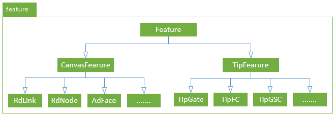
		
		feature由properties和geometry构成,properties当中有两个最重要的属性pid和geoLiveType.feature的geometry属性会被用来做要素选择,选中高亮等.feature的properties种只包含数据,不包含渲染相关信息.
		
	* `render:`
		
		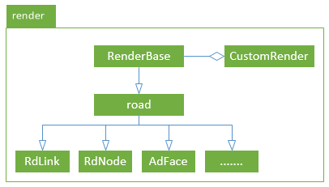
		
		render定义了每种feature如何进行渲染和划过高亮
		
	* `model:`
	
		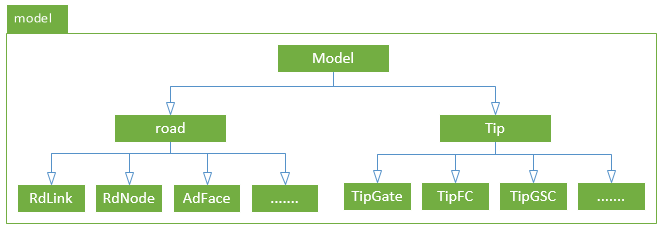
		
		model包定义了要素的编辑模型,主要用于属性编辑和几何编辑
		
* `uikit`
	
	* `check:`
		
		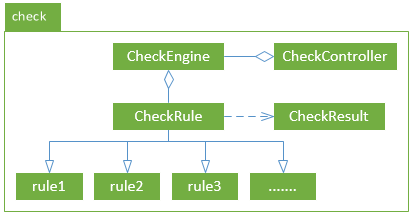
		
		check包实现了检查引擎,在对要素进行几何编辑的过程中对编辑每一步产生的结果进行业务检查
		
		CheckRule代表检查规则基类,所有的业务检查规则从此类派生
		
		CheckResult代表检查产生的结果
		
		CheckEngine代表检查引擎,检查引擎本质上是一个检查规则的集合,另外包含了检查时机,要素类型属性.检查引擎会将所包含的检查规则逐条进行验证,并记录下所有检查出来的错误.
		
		CheckController用于管理所有的检查引擎,提供获取检查引擎的接口
		
	* `operation:`
	
		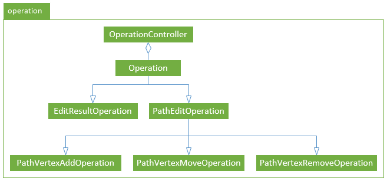
		
		operation包主要实现redo,undo功能
		
		Operation代表一个操作的基类
		
		EditResultOperation代表用于处理EditResult的操作
		
		PathEditOperation代表处理Path编辑的操作
		
		PathVertexAddOperation代表添加形状点的操作
		
		PathVertexMoveOperation代表移动形状点的操作
		
		PathVertexRemoveOperation代表删除形状点的操作
		
		OperationController用于管理所有的操作,内部维护一个操作栈,用于支持undo,redo功能
		
	* `tools:`
	
		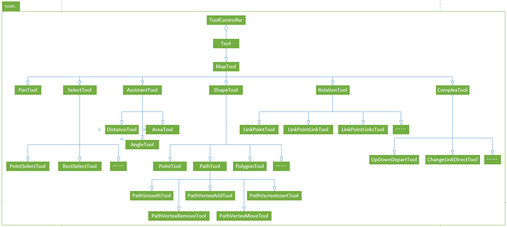
		
		tools包主要实现主要定义地图工具类,用于处理地图交互
		
		Tool代表工具的基类,定义了所有的鼠标和键盘事件接口以及工具的激活和反激活接口
		
		MapTool代表是跟地图操作相关的工具,实现了鼠标缩放地图和右键单击移动地图功能
		
		PanTool代表地图漫游工具,实现了鼠标拖拽,键盘移图等功能
		
		AssistantTool表示分析工具基类,测距,测角度,测面积都从此类派生
		
		DistanceTool代表距离测量工具,主要用于测距
		
		AreaTool代表面积测量工具,主要用于测量面积
		
		AngleTool代表角度测量工具,主要用于测量角度
		
		SelectTool表示选择工具基类,点选,框选等不同选择方式都从此类派生
		
		PointSelectTool代表点选工具,实现了点选任意要素功能
		
		RectSelectTool代表框选工具,实现了框选任意要素功能
		
		TrackSelectTool代表追踪选择工具,实现了追中选择任意类型link功能
		
		ShapeTool代表形状编辑工具的基类
		
		PointTool代表点编辑工具,主要用于点几何编辑
		
		PathTool代表线编辑工具,平滑修形,插入点,移动点,删除点,追加点都从此类派生
		
		PathSoomthTool代表平滑修形工具,主要用于线几何编辑,可以实现插点,删点,移点.注意平滑修形虽然有插点,删点,移点功能,但并不能取代插点,移点,删点工具,因为他们的侧重点不同,操作方式也不同,适用的场景也不同.
		
		PathVertexAddTool代表追加点工具,主要用于向线几何的起点或终点追加形状点
		
		PathVertexInsertTool代表插入点工具,主要用于向先几何的形状点之间插入形状点
		
		PathVerteMoveTool代表移动形状点工具,主要用于移动线几何上的形状点
		
		PathVertexRemoveTool代表删除形状点工具,主要用于删除线几何上的形状点
		
		RelationTool代表关系编辑工具的基类
		
		LinkPointTool代表线点工具,主要用于编辑由link,node组成的关系要素
		
		LinkPointLinkTool代表线点线工具,主要用于编辑由link,node,link组成的关系要素
		
		LinkPointLinksTool代表线点多线工具,主要用于编辑由link,node,links组成的关系要素
		
		ComplexTool代表复杂编辑工具基类,一些复杂的,特殊的编辑由此类派生
		
		UpDownDepartTool代表上下线分离工具,主要用于制作上下线分离
		
		ChangeLinkDirectTool代表改变link方向工具,主要用于在地图上修改link方向
		
		ToolController用于管理所有的工具,工具分类前台工具和后台工具,所有的后台工具同时处于激活状态,前台工具同一时间只能有一个处于激活状态,彼此之间保持互斥.ToolController负责接收地图的键盘和鼠标事件,并将事件分发到对应的工具.
		
	* `edit:`
		
		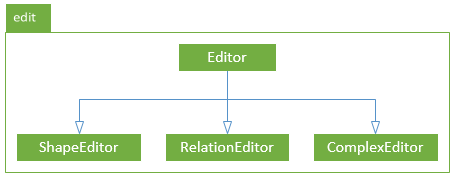
		
		edit包含三个部分形状编辑,关系编辑,复杂编辑
		
		Editor表示编辑器基类
		
		ShapeEditor表示形状编辑器,用于管理形状编辑工具,根据不同的编辑结果激活对应的形状编辑工具等
		
		RelationEditor表示关系编辑器,用于管理关系编辑工具,根据不同的编辑结果激活对应的关系编辑工具等
		
		ComplexEditor表示复杂编辑器,用于管理复杂编辑工具,根据不同的编辑结果激活对应的复杂编辑工具等
		
	* `topoEditor:`
		
		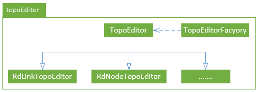
		
		topoEditor主要处理各种要素的增删改查等具体的业务逻辑,每种要素都有一个与之对应的topoEditor
		
		TopoEditor表示编辑器基类,提供增删改查业务的基本实现,并且为每种要素派生出一个子类.如果某要素的增删改查业务比较特殊,那就重写父类对应的方法.
		
	* `editControl:`
		
		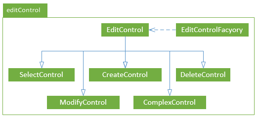
		
		editControl包主要实现编辑流程.可以把每一个地图操作,比如选择要素,删除要素,修改要素,查询要素等都抽象成流程,他们都是按照一定步骤组合来最终实现某种功能.
		
		主要分为SelectControl,CreateContrl,ModifyControl,DeleteControl,ComplexControl几种类型的编辑流程,每一种编辑流程下又可以根据不同业务逻辑进行细分从而进行更精细的流程控制
		
	* `highlight:`
		
		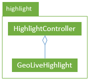
		
		highlight包主要实现要素模型的高亮.可以按照高亮规则来高亮要素模型的指定部分
		
		GeoLiveHighlight主要负责高亮一个模型对象,查找要素对应的高亮规则,并且按照高亮规则创建反馈
		
		HighlightController负责管理所有被高亮的对象

### 时序图

以创建要素为例,时序图如下

1. 用户点击工具条上的创建按钮
1. 新建一个创建要素流程并执行流程
1. 进行场景切换,流程切换,清除高亮等初始化操作
1. 启动形状编辑器
1. 激活对应工具
1. 工具进行初始化,安装捕捉器
1. 用户触发鼠标或者键盘操作
1. 工具接收到鼠标键盘事件
1. 开始捕捉地图要素
1. 到数据源中查询要素
1. 刷新结果反馈
1. 创建操作并进行实施检查
1. 操作入栈
1. 用户按下空格键
1. 工具将编辑结果返回给流程
1. 流程进行前检查
1. 调用topoEditor的create方法
1. topoEditor调用服务
1. 返回服务调用结果
1. 刷新图层,切换工具,发送到属性栏等清理工作

	
