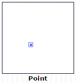
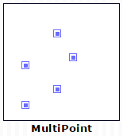
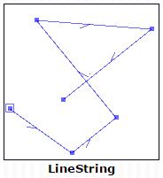
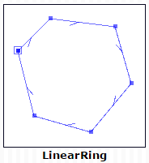
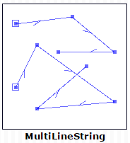
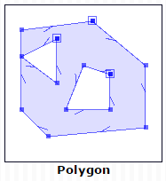
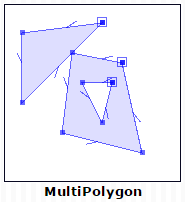
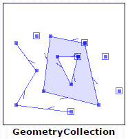

# 一体化编辑平台设计文档

## 目录

1. [地图基础知识](#地图基础知识)
	1. [地图术语](#地图术语)
	1. [坐标系统](#坐标系统)
	1. [基础计算](#基础计算)
1. [常用库介绍](#常用库介绍)
1. [总体架构图]()
1. [模块类图]()

## 地图基础知识

首先介绍一下地图软件常用的术语

### 地图术语

在地图软件中有一些特定的,约定俗成的术语:

* **[要素](#要素)**
* **[几何](#几何)**
* **[数据源](#数据源)**
* **[符号](#符号)**
* **[渲染](#渲染)**
* **[反馈](#反馈)**
* **[高亮](#高亮)**
* **[空间索引](#空间索引)**
* **[瓦片](#瓦片)**
* **[图幅](#图幅)**
* **[网格](#网格)**

#### 要素

现实世界中的任何物体都被抽象为地图要素Feature.地图要素主要有两个属性:

* `geometry:` 地图要素的几何属性,用于表达地图要素的形状,可以大致分为点线面几类,详见[几何](#几何)小节
* `properties:` 地图要素的除几何以外的其他属性,通常有一个id字段和type字段,组合起来可唯一标识一个要素

#### 几何

地图要素的几何属性可以根据[OpenGIS Simple Features Implementation Specification](http://www.opengeospatial.org/standards/sfa)分为以下几类:
* `Point:` 代表一个点

		
	
* `MultiPoint:` 若干点组成的集合

	
	
* `LineString:` 由若干点按顺序组成的线串,其中LinearRing是LineString的首尾点相等时的特例.其中组成LineSting的每个点称为**形状点**,两个形状点构成的直线段称为**形状边**

	
	
	
* `MultiLineString:` 若干LineString组成的集合

	
	
* `Polygon:` 多边形由一个外壳和若干洞组成,也可以没有洞.其中外壳是顺时针方向,洞是逆时针方向

	
	
* `MultiPolygon:` 若干Polygon组成的集合

	
	
* `GeometryCollection:` 若干任意类型Geometry组成的集合

	
	
#### 数据源

数据源代表了若干地图要素的集合,其中通常会按照[瓦片](#瓦片)和要素类型来组织数据,可能还包含有各种类型的索引.

#### 符号

符号是对绘制细节的抽象,负责将地图要素绘制成可见的各种符号.

#### 渲染

渲染指的是使用符号将地图要素绘制到设备上的过程.

#### 反馈

用户在地图上做的各种操作需要视觉反馈来告诉操作的结果.反馈由若干符号组成.

#### 高亮

当用户选中某个地图要素以后,需要将被选中的要素以突出的样式绘制出来,这称为要素的高亮.要素高亮由若干反馈组成.

#### 空间索引

为了提高几何查询的效率,通常会以要素几何的**最小外包矩形**构造空间索引,最长用的空间索引有**网格索引**,**R树**,**四叉树**等.

#### 瓦片

将横轴墨卡托投影得到的世界地图按照固定大小(通常是256或512)切成正方形小片,每一片都称为一个瓦片,通常0级地图用一个瓦片表示,1级地图使用4个瓦片表示,以此类推.其中每个瓦片都有固定的行列号x,y

#### 图幅

待补充

#### 网格

待补充

### 坐标系统

坐标系统可以分为两大类:
* 地理坐标系:为球面坐标.参考平面地是椭球面,坐标单位通常是经纬度
* 投影坐标系:为平面坐标.参考平面地是水平面,坐标单位通常是米、千米等,我国比较常用的投影坐标系有北京54和西安80坐标系
地理坐标转换到投影坐标的过程可理解为投影(投影：将不规则的地球曲面转换为平面)

通常需要计算以米为单位距离的时候需要先将经纬度转换成投影坐标.
关于坐标系统的更详细内容请阅读[链接](http://blog.csdn.net/angelazy/article/details/44085099)

### 基础计算

*向量: 很多牵涉到方向的运算过程使用向量会大大简化计算过程
*矩阵: 对于坐标的平移,旋转,缩放使用矩阵处理会更简单

### 常用库介绍

在Gis行业有些很成熟的开源库可以使用:

* `java topology suite:` 简称jts,提供一系列的几何运算方法,比如求交,并,差等,还有一系列的分析方法,比如缓冲区,凸包,重心,最近点等.拥有各种语言的移植版本,例如C++的geos,C#的nts,javascript的jsts等.[链接](https://locationtech.github.io/jts/javadoc/index.html)
* `proj4:` 提供各种坐标系之间的转换方法,也拥有众多语言的移植版本.[链接](https://github.com/proj4js/proj4js)
* `lodash:` lodash是从Underscore分化而来,提供了众多的基础的实用方法.已经成为最流行的基础库,众多开源项目都在使用,比如JavaScript转译器Babel、博客平台Ghost，和项目脚手架工具Yeoman.[链接](https://github.com/lodash/lodash/)

	
	
